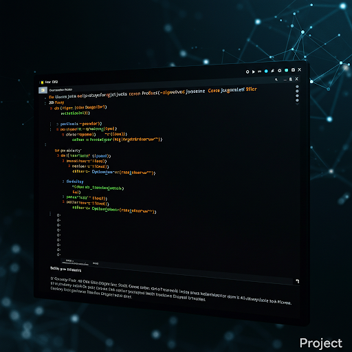
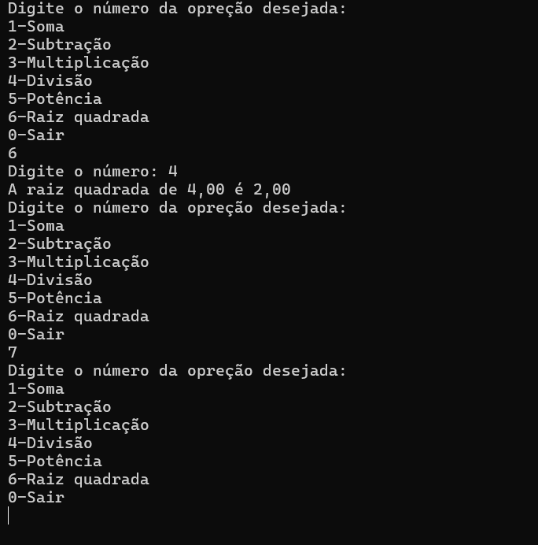

# Calculator Java

<div align="center">



<div data-badges>
 
 
 
 

</div>

<div data-badges>
 
</div>

</div> 

Este projeto é uma calculadora simples desenvolvida em Java que opera através do console. Ela permite realizar as operações matemáticas básicas de adição, subtração, multiplicação e divisão.

## Funcionalidades:

- Adição: Soma de dois números.
- Subtração: Subtrai um número de outro.
- Multiplicação: Multiplica dois números.
- Divisão: Divide um número1 por outro, com tratamento para divisão por zero.
- Potência: Calcula a potência entre uma base e um expoente.
- Raiz quadrada: Calcula a raiz quadrade de um número.

## Como rodar esse projeto

## Requisitos

Java Development Kit (JDK) instalado

### Execução

1. Clone esse repositório

    ```sh
    git clone https://github.com/Pablo-Sts/calculator_java
    ```

2. Acesse o diretório do projeto: 

    ```sh
    cd calculator_java
    ```

3. Abra o terminal na pasta do projeto e execute os seguintes comandos:

        ```sh
            javac Main.java
            java Main
        ```

## Preview



## Links úteis

- [Java](https://developer.mozilla.org/pt-BR/docs/Web/HTML)